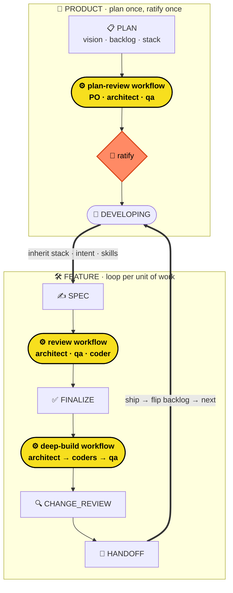
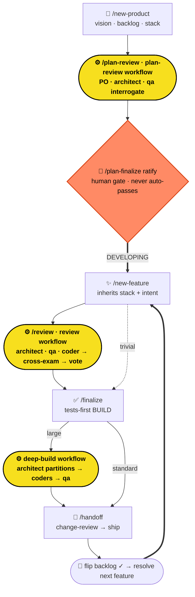
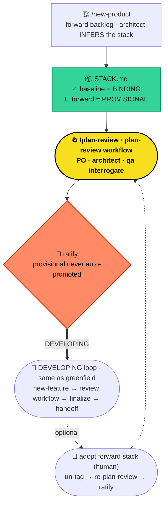
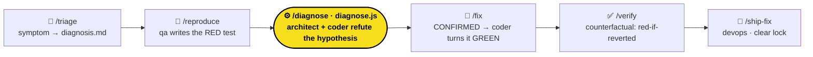

# build-fleet

A spec-driven multi-agent software house, packaged as a Claude Code plugin.
**v0.5**

build-fleet turns Claude Code into a disciplined software house. A fleet of role
subagents drives every change through a deterministic state machine —
**SPEC → REVIEW → FINALIZE → BUILD → CHANGE_REVIEW → HANDOFF** — with phase gates
enforced by hooks, not vibes. No source is written until the spec is FINALIZED;
no handoff until tests pass and the change is reviewed.

**v0.4 adds a product tier *above* the per-feature loop.** A product is planned
once — vision, a phased backlog, and a single binding **stack-of-record** — then
**ratified by a human**, and every feature thereafter *inherits* that stack and
its own one-line intent. The result is two nested cycles: a **PLAN** machine for
the product, and the **per-feature** machine for each unit of work, joined by a
**DEVELOPING loop** that advances the backlog one ratified feature at a time.

What's new in v0.4:

- **Product tier** — `/build-fleet:new-product` scaffolds `.sdd/_product/`
  (vision, backlog, stack, ADRs). Greenfield **ratifies** a fresh stack;
  brownfield **infers** the actual stack from code as a binding baseline.
- **PLAN machine** — `PLAN → PLAN_REVIEW → PLAN_FINALIZE → DEVELOPING`. Review is
  **interrogation, not a survival vote** (a strategic plan is weighed, not
  converged); finalize is a **human ratification gate that never auto-passes**.
- **Inheritance** — features inherit the binding stack, a per-feature **intent**
  (a 1–3 line scope sketch from the backlog), and routed **domain skills**.
- **DEVELOPING loop** — on ship, the backlog row flips to DONE and the next
  unblocked feature is resolved live; `/build-fleet:next-feature` advances it.
- **Product memory** — ratification writes a build-fleet block into the repo-root
  `CLAUDE.md`, non-clobbering and idempotent, so any Claude session inherits the
  product context.

Carried from v0.2: dynamic-workflow adversarial **REVIEW**, three-tier routing,
tests-first BUILD, and headless-first machine signals.

---

## The two cycles



> 🟡 **The yellow nodes are real JavaScript.** `review.js`, `plan-review.js`, and
> `deep-build.js` are dynamic-workflow scripts — each one fans out a whole team of
> agents, cross-examines them, and votes on the result. The workflow *is* code, not
> a prompt. That's the engine. (🙋 = a human gate.)

The product tier is **optional and additive** — a repo with no `.sdd/_product/`
is a plain feature-first project and behaves exactly as v0.2 did.

---

## Greenfield project cycle

A new product from scratch — the architect *ratifies* a forward stack.



---

## Brownfield project cycle

An existing codebase — the architect *infers* the real stack; only the current
baseline binds, and any forward/migration direction stays provisional until a
human promotes it.



The only brownfield-specific behavior is at planning time (infer-not-ratify,
baseline-binds, forward-is-provisional). Once `DEVELOPING`, the feature loop and
its workflows are the same as greenfield.

---

## What you get

**Seven role subagents.** The **main session is the orchestrator** — it routes,
gates, and writes `.sdd/` state, but never writes source itself.

| Role | Subagent | Writes | Model |
|---|---|---|---|
| Product Owner | `build-fleet:product-owner` | `spec.md`, `acceptance.md`, product `vision.md` + `backlog.md` | opus |
| Architect | `build-fleet:architect` | `DECISIONS.md`, product `STACK.md`, review notes | opus |
| Coder | `build-fleet:coder` | source, `IMPL_NOTES.md` | sonnet |
| QA | `build-fleet:qa` | `tests/`, `TEST_PLAN.md` | sonnet |
| DevOps | `build-fleet:devops` | CI/CD, release notes | sonnet |
| Classifier | `build-fleet:classifier` | *(read-only — emits a routing verdict + skill manifest)* | sonnet |
| Scribe | `build-fleet:scribe` | applies workflow state deltas to `.sdd/` (feature or product scope) | sonnet |

The **classifier** and **scribe** are infrastructure agents. The classifier sizes
incoming work and routes domain skills; the scribe is the canonical writer for
state mutations produced by dynamic workflows (workflow scripts cannot touch the
filesystem, so they hand a structured envelope to the scribe — which now targets
either `.sdd/<feature>/` or `.sdd/_product/` via a `workspace_dir` field).

**Four dynamic workflows** under `workflows/`: `review.js` (feature REVIEW),
`plan-review.js` (product PLAN_REVIEW), `deep-build.js` (fan-out BUILD), and
`diagnose.js` (bug-lane root-cause confirmation — the survival vote, inverted).
Plus a deterministic shared resolver (`scripts/next-feature.sh`, with an 18-case
test harness), seven craft skills, nine gate-enforcing hooks, and the shared
memory layer under `.sdd/`.

---

## Requirements

- **Claude Code v2.1.154 or later**, with the **dynamic workflows** feature
  enabled (`/config` → "Dynamic workflows" on Pro plans; on by default for
  Max / Team / Enterprise). build-fleet has a **hard** dependency on the
  `Workflow` tool — REVIEW, PLAN_REVIEW, and deep-build run as dynamic workflows,
  with no command-pipeline fallback. If the runtime is missing, the affected
  command refuses with `BUILD_FLEET_REFUSE: workflow runtime unavailable` (exit 3).
- For **headless** callers, `Workflow` must be in the session's allowed tools,
  e.g. `claude -p --allowedTools "Workflow,Read,Edit,Write,Bash,Agent,Task" …`.

---

## Install

The plugin is distributed from a GitHub repository as its own single-plugin
marketplace.

```
/plugin marketplace add https://github.com/rocar/build-fleet.git
/plugin install build-fleet
```

Then verify the fleet loaded — `/agents` should list all seven `build-fleet:*`
agents.

**Transport note.** The `owner/repo` shorthand (`/plugin marketplace add
rocar/build-fleet`) resolves to **SSH** (`git@github.com:…`). On a machine
without a GitHub SSH key configured it will fail with a publickey error — use
the full **HTTPS** URL shown above instead, or a local path during development.
If the repo is **private**, the same credential (SSH key or HTTPS token via
`gh auth`) must be able to read it.

For local development, point Claude Code at a working copy directly:

```
claude --plugin-dir /path/to/build-fleet
```

### Updating

The plugin cache is **keyed by version** (`.claude-plugin/plugin.json`'s
`version`). `/reload-plugins` only re-reads the *local* cache — it does **not**
re-fetch from GitHub. To pull a new release you must update the marketplace clone
and reinstall:

```
/plugin marketplace update build-fleet   # re-fetches the repo
/plugin update build-fleet               # installs the new version into a fresh cache
/reload-plugins
```

A version bump is required for the cache to refresh; same-version pushes won't
take effect on an installed instance.

---

## Quickstart

### Product-first (the v0.4 flow)

```
# 1. plan the product → scaffold vision + phased backlog + stack
/build-fleet:new-product my-product

# 2. interrogate the plan (workflow)
/build-fleet:plan-review

# 3. ratify it (human gate) → unlocks the DEVELOPING loop + writes product memory
/build-fleet:plan-finalize ratify

# 4. start the next backlog feature (or run /new-feature <slug> directly)
/build-fleet:next-feature        # resolves it; then:
/build-fleet:new-feature <slug>  # inherits the stack + the feature's intent
/build-fleet:review              # standard/large
/build-fleet:finalize
/build-fleet:handoff             # ships, flips the backlog, advances the loop
```

### Feature-only (no product tier)

```
/build-fleet:new-feature my-feature   # asks what it should do if not in context
/build-fleet:review                   # standard/large only
/build-fleet:finalize
/build-fleet:handoff
```

`new-feature` will **ask you what the feature should do** if it can't find a
description in the conversation *or* a usable backlog intent — the slug alone is
never treated as a spec. The exact path depends on the routing tier (below).

---

## The product tier (v0.4)

A product lives in a reserved `.sdd/_product/` namespace, inherited read-only by
every feature.

**The PLAN machine.** `PLAN → PLAN_REVIEW → PLAN_FINALIZE → DEVELOPING`, mirroring
the feature machine one level up but with an inverted temperament:

- **PLAN_REVIEW is interrogation, not a survival vote.** A feature spec is a
  contract the machine can adversarially *converge*; a product plan is a strategic
  bet a human must *weigh*. So `plan-review.js` fans out product-owner / architect
  / qa to surface questions, risks, and gaps (including **intent quality** — are
  the per-feature scopes clear and cleanly bounded?). Nothing is auto-killed and it
  never auto-escalates.
- **PLAN_FINALIZE is a human ratification gate that never auto-passes** — even with
  zero findings. Bare `/plan-finalize` is a dry-run that prints the report and
  halts; `ratify` flips state only with zero open blockers; `ratify force`
  overrides them on the record. It **never promotes** a `PROVISIONAL` stack entry —
  ratification finalizes the plan *as written*.

**Inheritance.** When `/build-fleet:new-feature` runs inside a product tier, the
feature inherits:

- the **binding stack-of-record** (everything in `STACK.md` not tagged provisional)
  — preventing two features from picking conflicting stacks;
- its **backlog intent** — a 1–3 line sketch (*what + scope boundary + non-goals*)
  that seeds the spec so the PO realizes the plan's intent instead of re-guessing
  from the slug. It stays boundary-level — **never** acceptance criteria or
  interfaces; those remain the feature's reviewed `spec.md`;
- routed **domain skills** (below).

**The DEVELOPING loop.** A full `/build-fleet:handoff` (devops success) atomically
flips the feature's backlog row to `[x] DONE`, recomputes its phase status, and
**clears `.sdd/ACTIVE`** so the next feature can start. The next unblocked feature
("first PENDING in the lowest phase whose `depends-on` are all DONE") is re-resolved
**live** from the backlog by the shared `scripts/next-feature.sh` — never a cached
index. `/build-fleet:next-feature` is the optional convenience that resolves +
gates the next one and emits a dispatch signal; it **surfaces, it doesn't
auto-advance** (advancement policy stays with you / the orchestrator).

**Product memory.** Ratification (and `/build-fleet:product-memory`) writes a
delimited `<!-- BEGIN/END build-fleet:product -->` block into the repo-root
`CLAUDE.md` — vision one-liner, binding stack, conventions — **non-clobbering**
(anything outside the markers is preserved) and **idempotent** (re-running
replaces the block in place). Your own notes live outside the markers and survive.

---

## The troubleshoot & bug-fix lane (v0.5)

Everything above is *forward engineering* — the spec is the contract. **v0.5 adds a second,
parallel state machine for the inverse: a bug whose cause is unknown.** It is purely additive — a
repo that never files a bug behaves exactly as before.



The inversion runs deep:

| | Forward feature machine | Bug lane |
|---|---|---|
| **Trigger** | a desired capability | a symptom |
| **Contract** | `spec.md` (FINALIZED) | `diagnosis.md` (CONFIRMED) |
| **The unknown** | *how* to build it | *why* it breaks (diagnosis **is** the work) |
| **Confirmation** | review survival-vote (a concern survives unless refuted) | `diagnose.js` — **inverted**: a hypothesis is CONFIRMED iff **no** refutation survives |
| **Verification** | acceptance criteria | the **counterfactual** — each reproducing test must fail if the fix is reverted |
| **Routing axis** | size (trivial/standard/large) | severity (sev0/sev1/sev2) |

**The keystone — the reproducing test is inviolable.** No fix source lands until `diagnosis.md` is
CONFIRMED **and** a test that reproduces the bug exists (a new hard hook,
`require-reproducing-test`). This holds even for a **sev0 hotfix**, which *may* skip the adversarial
confirmation workflow (recording a post-hoc obligation) but **never** the reproducing test. The
forward machine's keystones are reused verbatim: the CHANGE_REVIEW counterfactual becomes VERIFY,
and the survival-vote engine is forked-and-inverted for diagnosis confirmation.

**Sharp boundary with the trivial path.** A *known-cause* one-liner stays on the forward trivial
fast-path; only an *unknown-cause* bug enters this lane. `/build-fleet:triage`'s classifier routes
on cause-known-vs-unknown and bounces the known-cause case back out.

---

## Three-tier routing

When you run `/build-fleet:new-feature`, the **classifier** sizes the work and
writes `TIER` + `BUILD_MODE` into `PROGRESS.md`:

| Tier | Path | BUILD |
|---|---|---|
| **trivial** | skips REVIEW (`/build-fleet:finalize` straight from SPEC) | standard (qa → coder) |
| **standard** | full SPEC → REVIEW → FINALIZE → BUILD | standard (qa → coder) |
| **large** | full pipeline, then `BUILD_MODE=deep-build` | fan-out across partitioned coders |

The classifier is deliberately conservative: a **false-trivial is the dangerous
miss**, so anything touching auth, billing, or CI is never trivial, and a malformed
verdict falls back to `standard`. It also emits a **skill manifest** (below).
Re-check or override at any time:

- `/build-fleet:dispatch` — re-runs the classifier on the active feature
  (query-only; doesn't change state).
- Edit `PROGRESS.md`'s `TIER:` line by hand to force a tier.

---

## Skill routing

build-fleet stays **process machinery** — it ships no domain-craft skills. What it
ships is a routing convention (the **`skill-routing`** skill): the classifier maps
a feature's stack + type to the *names* of domain skills (generic role-craft names,
e.g. `api-design`, `cli-testing`), persists them to `SKILL_MANIFEST.md`, and the
BUILD roles **load them if available**. An unavailable skill is a no-op — recorded
(`skill-unavailable: <name>`) and the role proceeds with normal craft. Routing is
advisory; it never changes the tier or build mode.

---

## Dynamic workflows

Four phases run as Claude Code **dynamic workflows** (JS scripts under
`workflows/` executed by the Workflow runtime), not direct Task fan-outs:

- **`/build-fleet:review` → `workflows/review.js`.** Fan-out reviewers
  (architect/qa/coder) → adversarial **cross-examination** → **survival vote** →
  scribe applies the verdict. A concern survives only if it is *not* refuted by a
  different-role reviewer citing a specific `spec.md`/`acceptance.md` section. This
  kills plausible-but-unfounded concerns before they block finalize.
- **`/build-fleet:plan-review` → `workflows/plan-review.js`.** The product
  counterpart — product-owner/architect/qa **interrogate** the plan. **Forked, not
  parameterized:** no cross-examination, no survival vote, no auto-escalation. It
  produces an interrogation report; the human ratifies. The scribe writes the
  product workspace via `workspace_dir=".sdd/_product/"`.
- **deep-build → `workflows/deep-build.js`** (BUILD for `large` features).
  Architect partitions the work across files; coders fan out in parallel; overlap
  detection prevents two coders racing on the same file; an in-workflow adversarial
  review catches integration gaps before BUILD declares complete.
- **`/build-fleet:diagnose` → `workflows/diagnose.js`** (bug-lane DIAGNOSE). The
  survival-vote engine **forked and inverted**: architect + coder try to *refute*
  the recorded root-cause hypothesis, each citing the reproduction (`diagnosis.md`
  §, a `tests/` file, or a line number). The hypothesis is **CONFIRMED iff no
  substantive refutation survives** — the mirror image of `review.js`, where a
  concern survives unless refuted. The scribe records the verdict and advances to
  FIX; a **sev0** bug short-circuits the workflow entirely (post-hoc obligation).

Because a workflow can't write files, it emits a structured envelope that the
**scribe** applies. While a workflow runs, a `.workflow-in-flight` marker tells the
per-reviewer hooks to stand down (the workflow's post-conditions replace them); the
scribe deletes it on completion, and a Stop hook reaps orphaned markers older than
an hour.

> CYCLE counts **workflow runs**, not command invocations — cross-examination
> rounds inside a single run do not bump it. Feature review cycles are bounded
> (default 3); the 4th unresolved cycle writes `ESCALATION.md` and halts for a
> human. PLAN_REVIEW does not auto-escalate — only a human halts a plan.

---

## Command reference

**Product tier (v0.4):**

| Command | Phase | What it does |
|---|---|---|
| `/build-fleet:new-product <slug>` | PLAN | Scaffolds `.sdd/_product/`; PO drafts vision + phased backlog (with intents); architect ratifies (greenfield) or infers (brownfield) the stack. |
| `/build-fleet:plan-review` | PLAN_REVIEW | Runs the interrogation workflow over the plan. |
| `/build-fleet:plan-finalize [ratify [force]]` | PLAN_FINALIZE → DEVELOPING | Ratification gate. Bare = dry-run + halt; `ratify` flips to DEVELOPING + writes product memory; `ratify force` overrides open blockers. |
| `/build-fleet:product-memory` | — | (Re)generates the `CLAUDE.md` product block (non-clobbering, idempotent). |
| `/build-fleet:next-feature` | — | Resolves + gates the next unblocked backlog feature; emits a dispatch signal (does not auto-start). |

**Feature tier:**

| Command | Phase | What it does |
|---|---|---|
| `/build-fleet:new-feature <slug>` | SPEC | Scaffolds `.sdd/<slug>/`, runs the classifier, has PO draft `spec.md` + `acceptance.md`. Inherits the product stack + backlog intent if present; asks for a description otherwise. |
| `/build-fleet:dispatch` | — | Re-classifies the active feature (query-only). |
| `/build-fleet:review` | REVIEW | Runs the adversarial review workflow. (Skipped for trivial.) |
| `/build-fleet:finalize` | FINALIZE → BUILD | Gate: refuses on open blockers. On pass, flips spec to FINALIZED and orchestrates BUILD (qa-first, then coder; routes to deep-build for large). |
| `/build-fleet:deep-build` | BUILD | Directly dispatches the fan-out build workflow (normally invoked for you by finalize). |
| `/build-fleet:handoff` | CHANGE_REVIEW → HANDOFF | architect + PO + qa review the diff; refuses if tests are missing/failing. On pass devops ships, the backlog flips, and the loop advances. |
| `/build-fleet:status` | — | Prints active feature state, open concerns, cycle counts, the product backlog, and the next unblocked feature. **Bug-lane aware:** `LANE: bug` → phase / `SEV` / `diagnosis.md` STATUS / cycles. |

**Bug lane (v0.5):**

| Command | Phase | What it does |
|---|---|---|
| `/build-fleet:triage <symptom>` | → REPORT | Scaffolds `.sdd/<bug-slug>/diagnosis.md`; runs the bug-mode classifier (severity + cause-known); bounces a known-cause bug to the forward trivial path. |
| `/build-fleet:reproduce` | REPORT → REPRODUCE | qa writes a failing reproduction test under `tests/`; flips `diagnosis.md` `REPORTED→REPRODUCING`. |
| `/build-fleet:diagnose` | REPRODUCE → DIAGNOSE | Gates on a recorded root-cause hypothesis, then runs the `diagnose.js` confirmation workflow (sev0 short-circuits to the fast-path). |
| `/build-fleet:fix` | DIAGNOSE (confirmed) → FIX | Flips `diagnosis.md` → CONFIRMED (unlocks source), drives the coder to turn the reproducing test green. sev0 hotfix fast-path. |
| `/build-fleet:verify` | FIX → VERIFY | Reuses the counterfactual: each reproducing test must fail if the fix is reverted. Clean → `diagnosis.md` → FIXED. |
| `/build-fleet:ship-fix` | VERIFY → HANDOFF | devops ships (sev0 = hotfix); clears `.sdd/ACTIVE`. |

---

## Tests-first BUILD

In standard BUILD, `/build-fleet:finalize` sequences **qa before coder**: qa
authors a failing test suite from `acceptance.md` first, and coder refuses to begin
until those tests exist. CHANGE_REVIEW then applies a counterfactual gate — *would
each test fail without coder's change?* — so the suite actually pins the behavior
rather than rubber-stamping it.

---

## Headless mode

Every command prints machine-readable `BUILD_FLEET_*:` JSON lines **before** any
human prose, so an orchestrator can drive build-fleet non-interactively (e.g.
`claude -p`, the Agent SDK, or a Hermes profile) by parsing those signals.

Representative signals: `BUILD_FLEET_CLASSIFICATION`, `BUILD_FLEET_WORKFLOW_LAUNCHED`,
`BUILD_FLEET_FINALIZE_PASS` / `_REFUSE`, `BUILD_FLEET_BUILD_COMPLETE`,
`BUILD_FLEET_PLAN_FINALIZE_DRYRUN` / `_PASS` / `_REFUSE`,
`BUILD_FLEET_BACKLOG_FLIP`, `BUILD_FLEET_LOOP_ADVANCE`, `BUILD_FLEET_NEXT_FEATURE`
(+ `_REFUSE` / `_NEEDS_DESC`), `BUILD_FLEET_DEVOPS_OK` / `_REFUSED`,
`BUILD_FLEET_REFUSE`.

`plan-finalize` is the headless safety stop: a bare call emits the report and halts
— it can never ratify itself, so a `claude -p` run cannot commit a product plan
without an explicit `ratify` token.

---

## State lives in the target project

Everything the fleet produces lives in `.sdd/` in the **target project's** working
directory — never inside the plugin:

```
.sdd/
  ACTIVE                 # the one feature in flight (emptied on ship)
  PRODUCT                # product slug marker (if a product tier exists)
  _product/              # the product tier (optional, v0.4)
    vision.md            # PO — Overview / Goals (+ OUTCOME for standard/large)
    backlog.md           # PO — phased feature rows + per-feature intent lines
    STACK.md             # architect — the binding stack-of-record (inherited)
    DECISIONS.md         # architect — append-only product ADR log
    PROGRESS.md          # PRODUCT / SIZE / PHASE / CYCLE / UPDATED
    REVIEW.md            # append-only PLAN_REVIEW interrogation log
  <feature>/
    spec.md              # PO — STATUS: DRAFT|IN_REVIEW|FINALIZED|BLOCKED
    acceptance.md        # PO — testable criteria
    DECISIONS.md         # architect — append-only ADRs
    SKILL_MANIFEST.md    # routed domain skills for this feature (advisory)
    TEST_PLAN.md         # qa
    IMPL_NOTES.md        # coder
    REVIEW.md            # append-only review log (every cycle)
    PROGRESS.md          # orchestrator — phase, TIER, BUILD_MODE, handoff state
    ESCALATION.md        # only if review cycles exhausted
    .workflow-in-flight  # transient marker while a workflow runs
  <bug-slug>/            # bug lane (v0.5) — a /triage'd bug, same dir shape
    diagnosis.md         # the contract — STATUS: REPORTED|REPRODUCING|DIAGNOSED|CONFIRMED|FIXED
    PROGRESS.md          # LANE: bug · SEV · PHASE: REPORT…HANDOFF · CYCLE/FIX_CYCLE
    REVIEW.md            # append-only diagnose-workflow log
    DECISIONS.md         # architect — ADRs (shared format)
```

`<feature>/PROGRESS.md` carries the routing fields:

```
FEATURE: <slug>
PHASE:   SPEC | REVIEW | FINALIZE | BUILD | CHANGE_REVIEW | HANDOFF | ESCALATED
CYCLE:   <review-workflow runs>
CHANGE_CYCLE: <change-review rounds>
TIER:    trivial | standard | large | pending
BUILD_MODE: standard | deep-build | pending
UPDATED: <iso8601>
```

`_product/PROGRESS.md` carries the PLAN-machine fields:

```
PRODUCT: <slug>
SIZE:    small | standard | large
PHASE:   PLAN | PLAN_REVIEW | DEVELOPING | ESCALATED
CYCLE:   <plan-review runs>
UPDATED: <iso8601>
```

The plugin tree itself is read-only and re-installable; wiping and reinstalling the
plugin never touches your `.sdd/` state.

---

## Gates (enforced by hooks, not agents)

| Hook | Effect |
|---|---|
| `block-source-before-finalized` | Blocks writes outside `.sdd/` until `spec.md` is FINALIZED. |
| `restrict-reviewer-writes` | Confines writes to `.sdd/<active>/` during REVIEW / CHANGE_REVIEW. |
| `validate-spec-status` | Rejects a `spec.md` missing its STATUS line or required sections. |
| `validate-backlog-status` | Rejects a `_product/backlog.md` missing its `PRODUCT:` header, STATUS line, or phase headings. |
| `validate-diagnosis-status` | *(v0.5)* Rejects a `diagnosis.md` missing its STATUS line or required sections (the bug lane's `validate-spec-status`). |
| `require-reproducing-test` | *(v0.5)* Blocks a bug's fix source until `diagnosis.md` is CONFIRMED **and** a reproducing test exists under `tests/` — holds even for sev0. |
| `check-review-written` | Rejects a reviewer that stops without logging to `REVIEW.md`. |
| `stop-tests` | During BUILD / CHANGE_REVIEW / HANDOFF, blocks stop on a failing suite (tolerates "no tests collected" pre-suite). |
| `reap-stale-workflow-markers` | Removes orphaned `.workflow-in-flight` markers older than an hour. |

Hooks block with exit code 2 and return actionable feedback. They are the
deterministic backbone — agents can't talk their way past a gate. (Product-tier
operations refuse cleanly while a feature is mid-review rather than fighting the
reviewer-write confinement.)

---

## The rules live in a skill

The full workflow contract — both state machines, gate semantics, the
survival-vote convergence rule, the PLAN interrogation + ratification rules,
inheritance, the DEVELOPING loop, escalation policy, file ownership, and the
`PROGRESS.md` schemas — is encoded in the **`sdd-protocol`** skill, loaded
automatically by the commands and agents. Read it at
`skills/sdd-protocol/SKILL.md`. Supporting craft skills: `sdd-spec-template`,
`sdd-diagnosis-template` (the bug lane's `diagnosis.md` contract), `review-rubric`,
`adr`, `test-plan`, and `skill-routing`.

---

## Conventions

- One feature in flight per `.sdd/` at a time (named in `.sdd/ACTIVE`).
- One product tier per repo (in `.sdd/_product/`); it is optional and additive.
- A product plan is **ratified, not auto-decided**; provisional stack entries never
  bind until a human promotes them.
- Reviewers append to `REVIEW.md`; they never overwrite it.
- Every surviving design decision becomes an ADR in `DECISIONS.md`.
- The orchestrator (main session) never writes source — it routes and gates.
- Advancement is surfaced, never forced — the human/orchestrator chooses.
- Human escalation (and human ratification) is a first-class outcome, not a failure.

